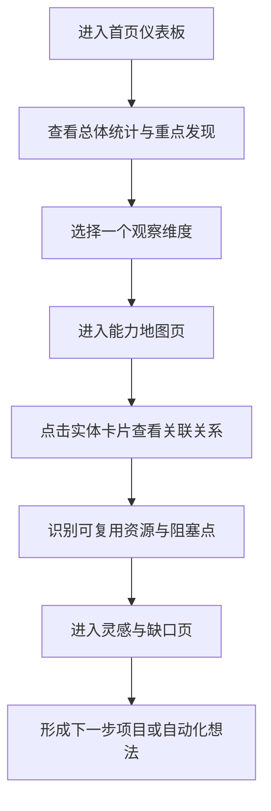

## 1. 产品概述
Beacon 是一个面向个人工作空间的能力资产总览原型，用来把项目、Agent、Skill、数据源、基础设施、工作流与二次加工数据统一可视化。
- 目标用户是你自己，核心问题是“资产很多但分散，难以知道自己已经具备什么能力、哪里可复用、哪里未同步、哪里还能延展出新想法”。
- 该原型的价值不在于完整 CRUD，而在于先建立一眼能看懂的“能力地图”与“灵感入口”。

## 2. 核心功能

### 2.1 功能模块
1. **首页仪表板**：总体统计、当前活跃能力、待处理项、重点发现。
2. **能力地图页**：以卡片和关系线索展示 Projects、Agents、Skills、Sources、Infra、Datasets、Workflows 六类实体。
3. **灵感与缺口页**：展示可复用资源、未同步 skills、高风险 source、可扩展 workflow。

### 2.2 页面详情
| 页面名称 | 模块名称 | 功能描述 |
|-----------|-------------|---------------------|
| 首页仪表板 | 顶部 Hero | 用一句话定义 Beacon，并提供“按项目看”“按 Agent 看”“按 Source 看”三个快捷入口 |
| 首页仪表板 | 统计条 | 展示项目数、Agent 数、Skill 数、可爬资源数、活跃工作流数 |
| 首页仪表板 | 今日发现 | 突出最值得关注的三类信息：未同步、可复用、受阻数据源 |
| 首页仪表板 | 关系预览 | 用静态关系块展示 `trip.jimmiewang.com -> ceair -> Playwright -> D1` 这种能力链 |
| 能力地图页 | 维度筛选器 | 切换查看 Projects / Agents / Sources / Infra / Skills / Datasets / Workflows |
| 能力地图页 | 实体卡片网格 | 每张卡片显示名称、状态、标签、最近验证时间、关联对象数量 |
| 能力地图页 | 关系侧栏 | 点击实体后展示其使用的来源、依赖的 infra、关联 workflow 与可跳转动作 |
| 灵感与缺口页 | 灵感清单 | 展示“只被一个项目使用的数据源”“还没产品化的数据资产”等启发式内容 |
| 灵感与缺口页 | 缺口面板 | 展示“哪些 Agent 缺 skill”“哪些 source 需要登录”“哪些 workflow 仍为 manual” |
| 灵感与缺口页 | 推荐动作 | 给出下一步建议，如“同步某 skill”“为某 source 建 watcher”“把某 dataset 做成页面” |

## 3. 核心流程
用户先进入首页快速感知当前能力全貌，再切到能力地图按某个维度展开查看关系，最后在灵感与缺口页发现可复用能力与待补齐项，从而激发新的项目或自动化动作。

## 4. 用户界面设计
### 4.1 设计风格
- 主色：深墨蓝、石墨黑、冷灰白
- 强调色：青蓝、荧黄、珊瑚红
- 按钮风格：圆角但硬朗，半透明描边按钮与高亮填充按钮并存
- 字体：标题使用有科技感但不浮夸的衬线或半衬线组合，正文使用清晰现代字体
- 布局风格：桌面优先，偏“操作台 + 编辑部情报板”混合风格
- 图标风格：线性图标、状态点、微型标签，不使用 emoji

### 4.2 页面设计概览
| 页面名称 | 模块名称 | UI 元素 |
|-----------|-------------|-------------|
| 首页仪表板 | 顶部 Hero | 大标题、短说明、玻璃质感统计胶囊、渐变背景与网格纹理 |
| 首页仪表板 | 统计条 | 高对比数字、细标签、状态色边线 |
| 首页仪表板 | 今日发现 | 三栏情报卡、轻微动效、显著优先级标记 |
| 能力地图页 | 维度筛选器 | 胶囊切换器、悬停高亮、当前维度强调描边 |
| 能力地图页 | 实体卡片网格 | 非对称卡片布局、分类色条、状态角标、元信息标签 |
| 能力地图页 | 关系侧栏 | 垂直信息线、引用关系、操作入口按钮 |
| 灵感与缺口页 | 灵感清单 | 编排感强的编辑部式条目卡片 |
| 灵感与缺口页 | 缺口面板 | 风险色块、状态标签、建议动作按钮 |

### 4.3 响应式
采用桌面优先设计，主目标分辨率为 1440px 宽以上；在平板与手机上退化为纵向卡片流与折叠侧栏，保证浏览可用但视觉重点仍放在桌面端。
