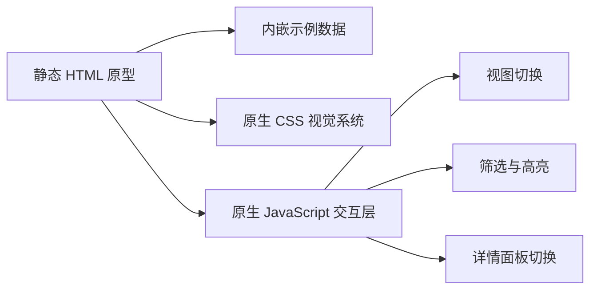
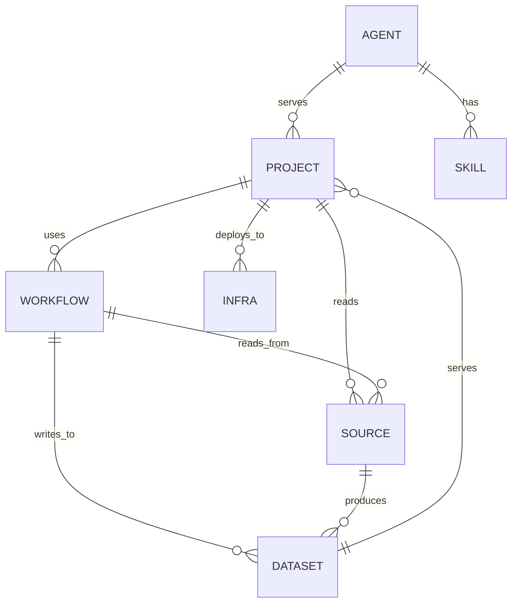

## 1. 架构设计


## 2. 技术描述
- 前端：原生 HTML5 + CSS3 + ES2020 JavaScript
- 初始化方式：手工建立静态原型目录，不引入框架与构建步骤
- 数据方式：页面内置 mock registry 数据，覆盖 projects、agents、skills、sources、infra、datasets、workflows
- 部署形式：本地直接打开 `index.html` 或后续用任意静态托管服务预览

## 3. 路由定义
| 路由 | 用途 |
|-------|---------|
| `/` | 能力资产首页，包含仪表板、能力地图、灵感与缺口 |

## 4. API 定义
本原型不接入后端 API，所有内容由前端内嵌数据驱动，重点验证信息架构、视觉层次与交互流。

可预留后续数据接口形态：

```ts
type RegistrySummary = {
  totals: {
    projects: number;
    agents: number;
    skills: number;
    sources: number;
    infra: number;
    workflows: number;
  };
  alerts: Array<{
    id: string;
    level: "info" | "warning" | "critical";
    title: string;
    detail: string;
  }>;
};

type RegistryEntity = {
  id: string;
  kind: "project" | "agent" | "skill" | "source" | "infra" | "dataset" | "workflow";
  name: string;
  status: "active" | "partial" | "blocked" | "experimental";
  tags: string[];
  summary: string;
  related: string[];
  updatedAt: string;
};
```

## 5. 数据模型
### 5.1 数据模型定义


### 5.2 原型数据定义
- 使用单个 `registryData` 对象作为页面内 mock 数据源。
- 每类实体至少提供 3 条示例记录，保证页面具备足够的信息密度。
- 重点示例必须包含：
  - `trip.jimmiewang.com`
  - `China Eastern / ceair`
  - `qtfm.cn`
  - `Hermes Main`
  - `trip-update-d1`
  - `Mac Mini launchd`
- 页面交互基于实体 `kind`、`status`、`tags` 和 `related` 字段做筛选与高亮。

## 6. 目录结构
```text
beacon.jimmiewang.com/
  index.html
  styles.css
  script.js
```

## 7. 实现约束
- 保持纯静态，不引入依赖与构建工具，方便你直接打开查看。
- 视觉重点放在桌面端，页面应在单屏内形成强烈的“能力总控台”感受。
- 交互只做轻量原型级实现：视图切换、实体选中、右侧详情刷新、基础 hover 动效。
- 内容文案全部使用中文，示例数据贴近你当前工作场景。
